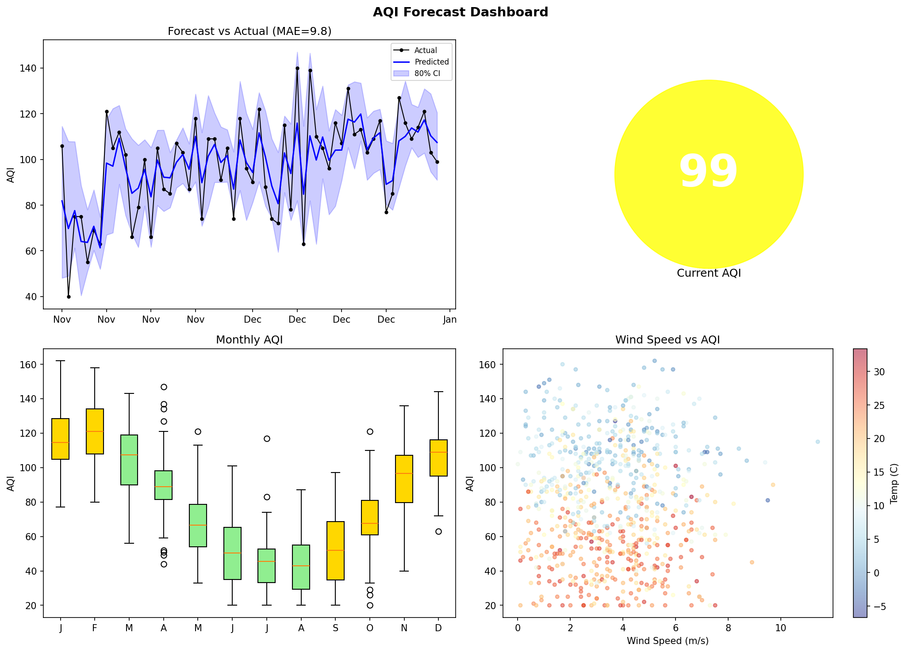

# aqi-forecast

Predict air quality from weather data. Winter in Qingdao gets pretty smoggy so I wanted to see if you can tell from temperature/wind/humidity whether tomorrow will be bad.

Uses random forest on historical AQI + weather observations. Generates a dashboard with forecast, monthly trends, and a wind vs AQI scatter.

Run `python data_loader.py` to generate sample data, then `python model.py` to train, `python dashboard.py` for plots.

Needs pandas, sklearn, matplotlib.
