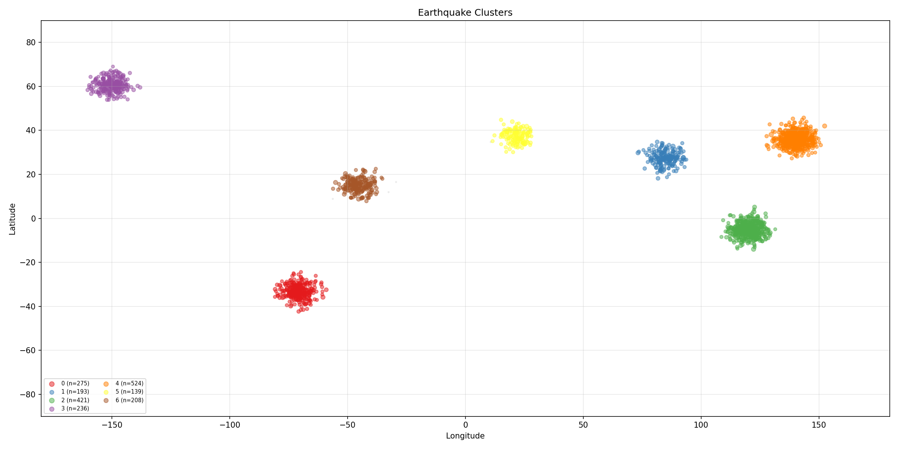
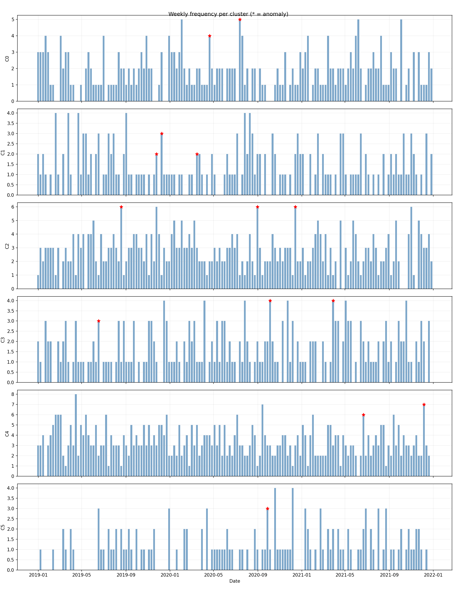

# earthquake-patterns

Playing around with USGS earthquake data. Downloads historical earthquakes, clusters them by location with DBSCAN, then checks for unusual spikes in activity per cluster.

Run `python main.py` to generate sample data and produce the plots. Needs pandas, sklearn, matplotlib, requests.

