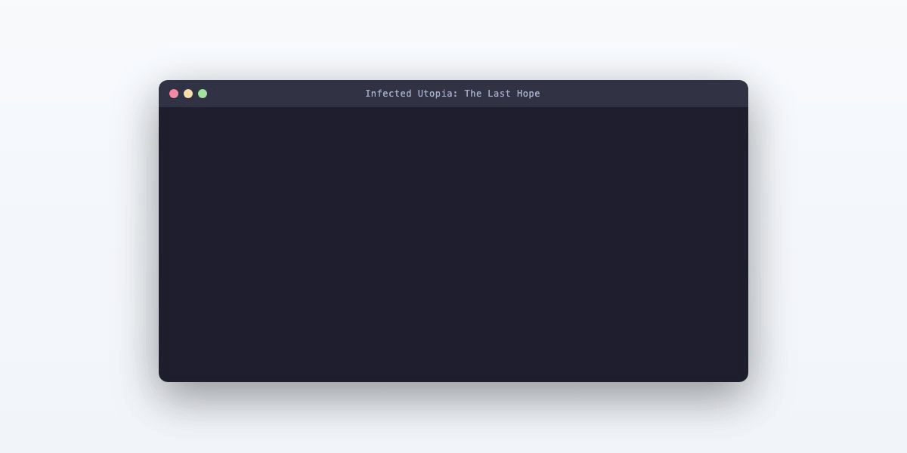

# Infected Utopia: The Last Hope

Terminal RPG set in a post-apocalyptic HKU campus overrun by cordyceps zombies. Navigate three floors of Run Run Shaw Tower, fight through infected hordes, manage inventory and currency, and retrieve the cure blueprint.



## Gameplay

- WASD movement on ASCII maps with room transitions and portals
- Turn-based combat with dodge rolls, critical hits, and shield/grenade gadgets
- Character selection with different stat distributions
- Shop system using LabTokens looted from defeated enemies
- Inventory with weapons, armor, medicine, and consumables managed through smart pointers
- Three floors with increasing difficulty, maze puzzles, and a final boss

## Build

```
make main
./main
```

## Architecture

All game logic in `hope.cpp` (~1800 lines), with character selection (`chooseCharacter.cpp`) and system utilities (`systemf.cpp`) as separate modules. Entity class hierarchy uses `shared_ptr` for dynamic inventory management. Combat system supports status effects, shield duration tracking, and AoE grenade damage.
